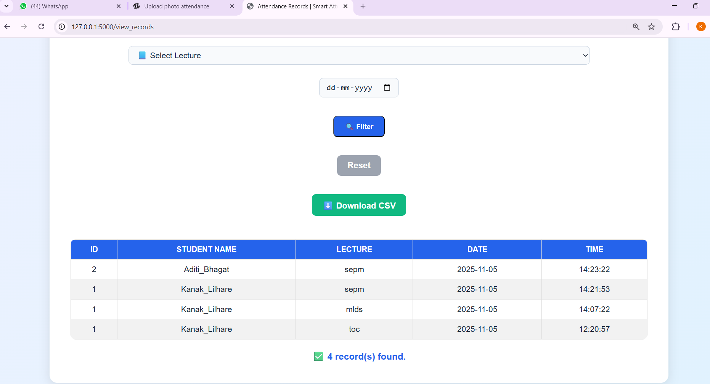

# 🎓 Smart Attendance System Using Face Recognition

A Python-based Smart Attendance System that uses Face Recognition to automatically identify students and mark attendance in real time. The system provides a user-friendly interface for teachers to manage students, capture face datasets, train the recognition model, and export attendance reports.

---

## 🚀 Features

### 👨‍🏫 Teacher Module
- Teacher Login System
- Secure Attendance Management
- Attendance Report Export (CSV)

### 👨‍🎓 Student Module
- Add New Students
- Automatic Face Dataset Creation
- Student Information Storage

### 🤖 Face Recognition Module
- Real-Time Face Detection
- Face Training and Recognition
- Automatic Student Recognition
- Attendance Marking

### 📊 Attendance Management
- SQLite Database Storage
- Daily Attendance Tracking
- Duplicate Attendance Prevention
- Attendance Report Generation

---

## 🛠️ Technologies Used

- Python 3.10+
- OpenCV (`opencv-python==4.12.0.88`)
- OpenCV Contrib (`opencv-contrib-python==4.12.0.88`)
- NumPy
- Pillow (PIL)
- Flask
- Flask-SQLAlchemy
- SQLite Database
- Tabulate
- HTML
- CSS
- JavaScript

---

## 📂 Project Structure

```text
Smart_Attendance/
│
├── static/
│   ├── css/
│   ├── js/
│   └── images/
│
├── templates/
│   ├── home.html
│   ├── attendance.html
│   ├── students.html
│   └── ...
│
├── Attendance/
├── StudentDetails/
├── TrainingImage/
├── TrainingImageLabel/
│
├── app.py
├── attendance.db
├── requirements.txt
└── README.md
```

---

## ⚙️ Installation

### 1. Clone Repository

```bash
git clone https://github.com/yourusername/Smart_Attendance.git
cd Smart_Attendance
```

### 2. Create Virtual Environment

```bash
python -m venv venv
```

### Activate Environment

**Windows**

```bash
venv\Scripts\activate
```

**Linux / macOS**

```bash
source venv/bin/activate
```

### 3. Install Dependencies

```bash
pip install -r requirements.txt
```

Or install manually:

```bash
pip install opencv-python==4.12.0.88
pip install opencv-contrib-python==4.12.0.88
pip install numpy
pip install pillow
pip install flask
pip install flask_sqlalchemy
pip install tabulate
```

---

## ▶️ Running the Application

```bash
python app.py
```

After successful execution, open your browser and visit:

```text
http://127.0.0.1:5000/
```

---

## 📋 How It Works

### Step 1: Add Student
- Register a new student
- Capture face images
- Store student information in database

### Step 2: Train Model
- Generate face recognition data
- Save trained model for future recognition

### Step 3: Mark Attendance
- Start camera
- Detect and recognize faces
- Automatically record attendance

### Step 4: View Attendance
- Access attendance reports
- Review attendance history
- Export attendance records

---

## 🧠 Face Recognition Workflow

```text
Student Face
      ↓
Face Detection
      ↓
Feature Extraction
      ↓
Face Recognition
      ↓
Student Identification
      ↓
Attendance Marked
```

---

## 📊 Database Schema

### Students Table

| Column | Type |
|----------|---------|
| Student_ID | TEXT |
| Name | TEXT |

### Attendance Table

| Column | Type |
|----------|---------|
| Student_ID | TEXT |
| Name | TEXT |
| Date | TEXT |
| Time | TEXT |

---

## 🔮 Future Enhancements

- Email Attendance Reports
- Cloud Database Integration
- Mobile Application Support
- Face Mask Detection
- Attendance Analytics Dashboard
- Multi-Camera Support
- QR Code Based Attendance
- Flask Authentication System

---

## 📸 Screenshots

### 🏠 Home Page


### 👨‍🎓 Teacher Registration


### 📊 Attendance Reports




---

## 📋 Requirements

```txt
opencv-python==4.12.0.88
opencv-contrib-python==4.12.0.88
numpy
pillow
flask
flask_sqlalchemy
tabulate
```


## 📄 License

This project is licensed under the MIT License.

---

## 👨‍💻 Author

**Kanak Lilhare**

Data Science & AI Enthusiast

GitHub: https://github.com/KanakLilhare

---

⭐ If you found this project useful, don't forget to star the repository.
